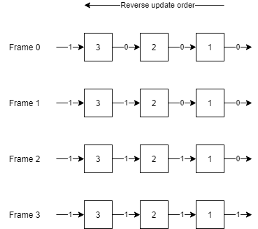

# Barotrauma-Circuit-Resolver
In Barotrauma, components are updated in the order of their IDs. Each component is updated only once during each frame. This can lead to delays in the signal propagation or even break circuit operation entirely, as most components calculate and send their output only upon being updated. 

Increasing the timeframe can be a solution in some cases, but this can be problematic for circuits using toggle_state inputs or circuits that rely on precise timing. (control circuits, counters, etc.)

This circuit resolver removes these delays by redistributing the IDs over components such that components are only updated after the components that come before them have been updated. This is done using topological sorting.

## Prerequisites
Microsoft .NET Core 3.1

## Installation
Either build from source, or [download the compressed executable here](https://github.com/Jlobblet/Barotrauma-Circuit-Resolver/releases/tag/v1.0.0)

## Usage
Run `Barotrauma-Circuit-Resolver.exe`

# In depth explanation
To illustrate the problem, consider this simple chain of components where the IDs are in the reverse order:

When component 1 and 2 are first updated, they will still have 0 at its input. In the first frame, only component 3 will update its output. It is only in the frame 1 that component 2 will process the new output of component 3, and only in frame 2 that component 1 will in turn process the new output of component 2. 

In circuits with longer chains of components, this can cause considerable delays which may change the order at which signals arrive. This can lead to incorrect results.

The circuit resolver will sort the IDs to instead be in the order of signal propagation: 

Now component 1 will calculate its output first. This means that once component 2 is updated in the same frame it will already have the output of component 1. There will then no longer be a delay.

# Special cases
One special case that the program does consider is the update order of storage elements such as memory components and relays (which can be considered 1 bit storage devices. Also note that opening a relay or sending signals through it does not require an update. On an update the relay only sends out its state). These components are updated in reverse order. This makes the memory components behave as 1 frame delays and also allows for the construction of useful circuits such as shift registers (which can then be implemented as a simple series chain of mems).

There are a few special cases that currently can not be solved with this topological sorting within a decent timeframe. 
The first problem is that arithmetic loops (loops not containing any storage element) can not be sorted entirely. However, these loops are usually unstable and their update order is therefore considered unimportant. 
The second problem involves the magical class of circuits that is frame-independent, made only out of frame-independent components (such as signal checks and relays) to allow for processing as many signals as desired within a single frame. These circuits however are technically an exploit and because of this are not covered by the program :)

